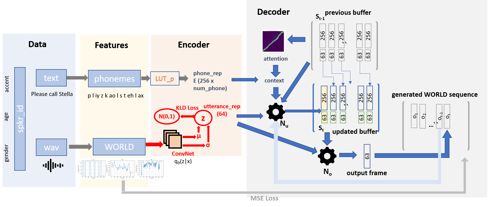

# Disentanglement Without Labels: BetaVAE

## US-21
Samples generated from the US-21 model, with embedding vectors z selected in one of two ways: 
* ##### [Sample z from N(0,1)](vae_random_sample.md): Pick embedding at random from the prior distribution

* ##### [Sample z|x given a reference utterance x](vae_reference_utterance.md) Start with a reference utterance (x), and sample from the posterior distribution over the embedding space, p(z|x) 

## All-107
Samples generated from the All-107 model. The page shows pairs of samples based on a starting embedding vector: one of the pair sets factor 58=-1; the other sets factor 58=+1.

