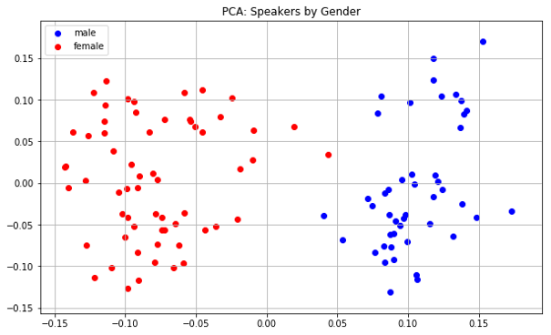
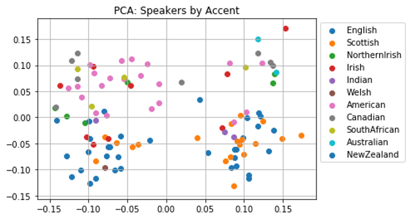
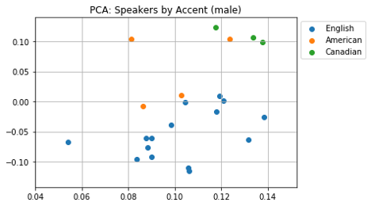
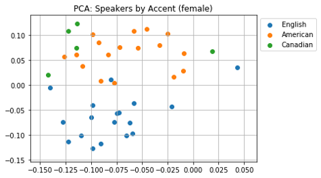
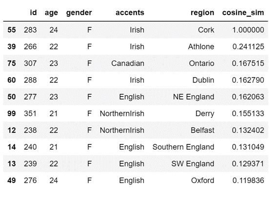

# Speaker Representations in VoiceLoop

* [Speaker Embeddings](#speaker-embeddings)
* [Gender Transformation](#gender-transformation)
* [Accent Transformation](#accent-transformation)

## Speaker Embeddings
The speaker embeddings clearly separate by gender.

The interpretability of the space by accent is not so obvious at first...

But if we show only English and North American speakers, it becomes much more obvious:

If we look at the speakers 'closest' to speaker 283 (Irish female), based on the cosine similarity of their embeddings, we find them all to be female, and mostly Irish or English.

## Gender Transformation
Start by finding the average embeddings of males and and females. Then, define a crude gender transformation as the vector difference between these average points. 

I took a short piece of text from the BBC news website:
> _"How trying to stay cool could make the world even hotter."_

* I first generated this string in the voice of an Irish female. 
* Then, I applied the female->male transformation vector to the embedding to get a new embedding, to find a point in the space that doesn't correspond to any known speaker. The speech generated using this embedding sounded like an Irish male. 
* Finally, I applied _double_ the gender transformation vector to the original embedding. The resulting audio sounding like a very deep, exaggerated Irish male voice.

| Description | Audio | 
| --- | --- |  
| Speaker 39 (Irish Female) | <audio src="ppt/baseline_gender_tranform_39_base.wav" controls></audio> |
|+ female -> male transformation | <audio src="ppt/baseline_gender_tranform_39.wav" controls></audio> |
|+ 2x female -> male transformation | <audio src="ppt/baseline_gender_tranform_39_x2.wav" controls></audio> |

# Accent Transformation
I defined an English -> American accent transformation vector in a similar way. 

I then took another short piece of text from the BBC news website:
> _"More than two million player ratings were awarded by users."_

and generated it into speech in the voice of an English female. When I applied the English -> American vector to get a new speaker embedding and generated the text using that vector, the voice was transformed into an American female. 

| Description | Audio | 
| --- | --- |
|Speaker 34 (English Female) |<audio src="ppt/baseline_accent_transform_34_base.wav" controls></audio> |
|+ English -> American transformation |<audio src="ppt/baseline_accent_transform_34.wav" controls></audio> |

