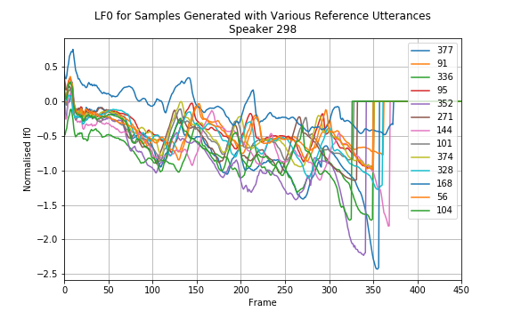

# Utterance-All-107

#### Speaker 298: M, 19, Irish (Tipperary)
[gender...]

*"She may even appear in some more films"*

|  # | Ref Sentence ID | Ref Utterance | Synth Sample
| --- | --- | --- | --- |
| 1 | 377 | <audio src="utterance/all_107/p298_377.orig.wav" controls></audio> | <audio src="utterance/all_107/more_films_298_377.wav" controls></audio>  |
| 2 | 91 | <audio src="utterance/all_107/p298_091.orig.wav" controls></audio> | <audio src="utterance/all_107/more_films_298_91.wav" controls></audio>  |
| 3 | 336 | <audio src="utterance/all_107/p298_336.orig.wav" controls></audio> | <audio src="utterance/all_107/more_films_298_336.wav" controls></audio>  |
| 4 | 95 | <audio src="utterance/all_107/p298_095.orig.wav" controls></audio> | <audio src="utterance/all_107/more_films_298_95.wav" controls></audio>  |
| 5 | 352 | <audio src="utterance/all_107/p298_352.orig.wav" controls></audio> | <audio src="utterance/all_107/more_films_298_352.wav" controls></audio>  |
| 6 | 271 | <audio src="utterance/all_107/p298_271.orig.wav" controls></audio> | <audio src="utterance/all_107/more_films_298_271.wav" controls></audio>  |
| 7 | 144 | <audio src="utterance/all_107/p298_144.orig.wav" controls></audio> | <audio src="utterance/all_107/more_films_298_144.wav" controls></audio>  |
| 8 | 101 | <audio src="utterance/all_107/p298_101.orig.wav" controls></audio> | <audio src="utterance/all_107/more_films_298_101.wav" controls></audio>  |
| 9 | 374 | <audio src="utterance/all_107/p298_374.orig.wav" controls></audio> | <audio src="utterance/all_107/more_films_298_374.wav" controls></audio>  |
| 10 | 328 | <audio src="utterance/all_107/p298_328.orig.wav" controls></audio> | <audio src="utterance/all_107/more_films_298_328.wav" controls></audio>  |
| 11 | 168 | <audio src="utterance/all_107/p298_168.orig.wav" controls></audio> | <audio src="utterance/all_107/more_films_298_168.wav" controls></audio>  |
| 12 | 56 | <audio src="utterance/all_107/p298_056.orig.wav" controls></audio> | <audio src="utterance/all_107/more_films_298_56.wav" controls></audio>  |
| 13 | 104 | <audio src="utterance/all_107/p298_104.orig.wav" controls></audio> | <audio src="utterance/all_107/more_films_298_104.wav" controls></audio>  |