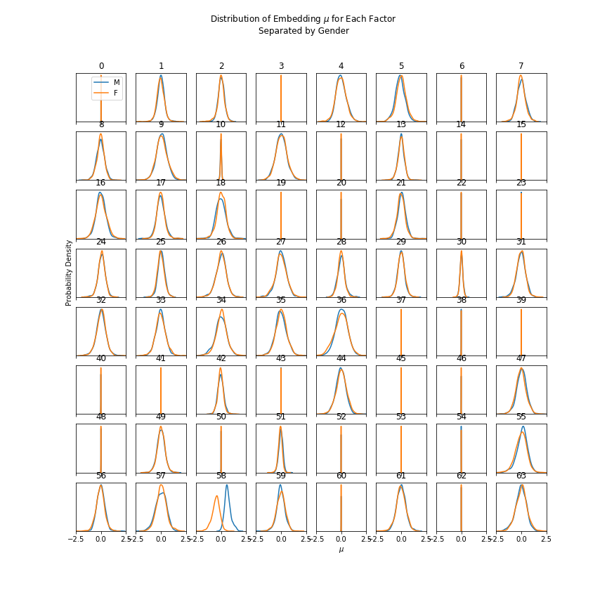

# Beta-VAE on All-107

### Factor 58 Controls Gender
I picked utterances at random, computer their MAP embeddings (i.e. using mu|x) and generated samples using these embeddings with two changes:
* Factor 58 set to -1
* Factor 58 set to +1 

|  # | Factor 58 = -1 | Factor 58 = +1 |  
| --- | --- | --- | 
| 1 | <audio src=" vae/all/test_latext_58_embedding_612_-1.0.wav" controls></audio> | <audio src=" vae/all/test_latext_58_embedding_612_1.0.wav" controls></audio> |
| 2 | <audio src=" vae/all/test_latext_58_embedding_1642_-1.0.wav" controls></audio> | <audio src=" vae/all/test_latext_58_embedding_1642_1.0.wav" controls></audio> |
| 2 | <audio src=" vae/all/test_latext_58_embedding_2566_-1.0.wav" controls></audio> | <audio src=" vae/all/test_latext_58_embedding_2566_1.0.wav" controls></audio> |
