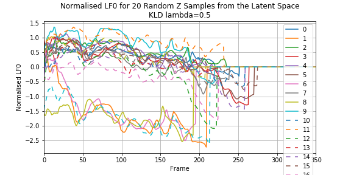

# Randomly sample z from N(0,1)

|  # | Beta=0.5 | Beta=1 | Beta=2 | Beta=5 | 
| --- | --- | --- | --- | --- |
| 1 | <audio src=" vae/samples_from_z/lambda_0.5_sample_z_0.wav" controls></audio> | <audio src=" vae/samples_from_z/lambda_1_sample_z_0.wav" controls></audio>  |  <audio src=" vae/samples_from_z/lambda_2_sample_z_0.wav" controls></audio>  |  <audio src=" vae/samples_from_z/lambda_5_sample_z_0.wav" controls></audio>  |
| 2 | <audio src=" vae/samples_from_z/lambda_0.5_sample_z_1.wav" controls></audio> | <audio src=" vae/samples_from_z/lambda_1_sample_z_1.wav" controls></audio>  |  <audio src=" vae/samples_from_z/lambda_2_sample_z_1.wav" controls></audio>  |  <audio src=" vae/samples_from_z/lambda_5_sample_z_1.wav" controls></audio>  | 
| 3 | <audio src=" vae/samples_from_z/lambda_0.5_sample_z_2.wav" controls></audio> | <audio src=" vae/samples_from_z/lambda_1_sample_z_2.wav" controls></audio>  |  <audio src=" vae/samples_from_z/lambda_2_sample_z_2.wav" controls></audio>  |  <audio src=" vae/samples_from_z/lambda_5_sample_z_2.wav" controls></audio>  |
| 4 | <audio src=" vae/samples_from_z/lambda_0.5_sample_z_3.wav" controls></audio> | <audio src=" vae/samples_from_z/lambda_1_sample_z_3.wav" controls></audio>  |  <audio src=" vae/samples_from_z/lambda_2_sample_z_3.wav" controls></audio>  |  <audio src=" vae/samples_from_z/lambda_5_sample_z_3.wav" controls></audio>  |
| 5 | <audio src=" vae/samples_from_z/lambda_0.5_sample_z_4.wav" controls></audio> | <audio src=" vae/samples_from_z/lambda_1_sample_z_4.wav" controls></audio>  |  <audio src=" vae/samples_from_z/lambda_2_sample_z_4.wav" controls></audio>  |  <audio src=" vae/samples_from_z/lambda_5_sample_z_4.wav" controls></audio>  | 
| 6 | <audio src=" vae/samples_from_z/lambda_0.5_sample_z_5.wav" controls></audio> | <audio src=" vae/samples_from_z/lambda_1_sample_z_5.wav" controls></audio>  |  <audio src=" vae/samples_from_z/lambda_2_sample_z_5.wav" controls></audio>  |  <audio src=" vae/samples_from_z/lambda_5_sample_z_5.wav" controls></audio>  |
| 7 | <audio src=" vae/samples_from_z/lambda_0.5_sample_z_6.wav" controls></audio> | <audio src=" vae/samples_from_z/lambda_1_sample_z_6.wav" controls></audio>  |  <audio src=" vae/samples_from_z/lambda_2_sample_z_6.wav" controls></audio>  |  <audio src=" vae/samples_from_z/lambda_5_sample_z_6.wav" controls></audio>  | 
| 8 | <audio src=" vae/samples_from_z/lambda_0.5_sample_z_7.wav" controls></audio> | <audio src=" vae/samples_from_z/lambda_1_sample_z_7.wav" controls></audio>  |  <audio src=" vae/samples_from_z/lambda_2_sample_z_7.wav" controls></audio>  |  <audio src=" vae/samples_from_z/lambda_5_sample_z_7.wav" controls></audio>  |
| 9 | <audio src=" vae/samples_from_z/lambda_0.5_sample_z_8.wav" controls></audio> | <audio src=" vae/samples_from_z/lambda_1_sample_z_8.wav" controls></audio>  |  <audio src=" vae/samples_from_z/lambda_2_sample_z_8.wav" controls></audio>  |  <audio src=" vae/samples_from_z/lambda_5_sample_z_8.wav" controls></audio>  |
| 10 | <audio src=" vae/samples_from_z/lambda_0.5_sample_z_9.wav" controls></audio> | <audio src=" vae/samples_from_z/lambda_1_sample_z_9.wav" controls></audio>  |  <audio src=" vae/samples_from_z/lambda_2_sample_z_9.wav" controls></audio>  |  <audio src=" vae/samples_from_z/lambda_5_sample_z_9.wav" controls></audio>  |
| 11 | <audio src=" vae/samples_from_z/lambda_0.5_sample_z_10.wav" controls></audio> | <audio src=" vae/samples_from_z/lambda_1_sample_z_10.wav" controls></audio>  |  <audio src=" vae/samples_from_z/lambda_2_sample_z_10.wav" controls></audio>  |  <audio src=" vae/samples_from_z/lambda_5_sample_z_10.wav" controls></audio>  |
| 12 | <audio src=" vae/samples_from_z/lambda_0.5_sample_z_11.wav" controls></audio> | <audio src=" vae/samples_from_z/lambda_1_sample_z_11.wav" controls></audio>  |  <audio src=" vae/samples_from_z/lambda_2_sample_z_11.wav" controls></audio>  |  <audio src=" vae/samples_from_z/lambda_5_sample_z_11.wav" controls></audio>  | 
| 13 | <audio src=" vae/samples_from_z/lambda_0.5_sample_z_12.wav" controls></audio> | <audio src=" vae/samples_from_z/lambda_1_sample_z_12.wav" controls></audio>  |  <audio src=" vae/samples_from_z/lambda_2_sample_z_12.wav" controls></audio>  |  <audio src=" vae/samples_from_z/lambda_5_sample_z_12.wav" controls></audio>  |
| 14 | <audio src=" vae/samples_from_z/lambda_0.5_sample_z_13.wav" controls></audio> | <audio src=" vae/samples_from_z/lambda_1_sample_z_13.wav" controls></audio>  |  <audio src=" vae/samples_from_z/lambda_2_sample_z_13.wav" controls></audio>  |  <audio src=" vae/samples_from_z/lambda_5_sample_z_13.wav" controls></audio>  |
| 15 | <audio src=" vae/samples_from_z/lambda_0.5_sample_z_14.wav" controls></audio> | <audio src=" vae/samples_from_z/lambda_1_sample_z_14.wav" controls></audio>  |  <audio src=" vae/samples_from_z/lambda_2_sample_z_14.wav" controls></audio>  |  <audio src=" vae/samples_from_z/lambda_5_sample_z_14.wav" controls></audio>  | 
| 16 | <audio src=" vae/samples_from_z/lambda_0.5_sample_z_15.wav" controls></audio> | <audio src=" vae/samples_from_z/lambda_1_sample_z_15.wav" controls></audio>  |  <audio src=" vae/samples_from_z/lambda_2_sample_z_15.wav" controls></audio>  |  <audio src=" vae/samples_from_z/lambda_5_sample_z_15.wav" controls></audio>  |
| 17 | <audio src=" vae/samples_from_z/lambda_0.5_sample_z_16.wav" controls></audio> | <audio src=" vae/samples_from_z/lambda_1_sample_z_16.wav" controls></audio>  |  <audio src=" vae/samples_from_z/lambda_2_sample_z_16.wav" controls></audio>  |  <audio src=" vae/samples_from_z/lambda_5_sample_z_16.wav" controls></audio>  | 
| 18 | <audio src=" vae/samples_from_z/lambda_0.5_sample_z_17.wav" controls></audio> | <audio src=" vae/samples_from_z/lambda_1_sample_z_17.wav" controls></audio>  |  <audio src=" vae/samples_from_z/lambda_2_sample_z_17.wav" controls></audio>  |  <audio src=" vae/samples_from_z/lambda_5_sample_z_17.wav" controls></audio>  |
| 19 | <audio src=" vae/samples_from_z/lambda_0.5_sample_z_18.wav" controls></audio> | <audio src=" vae/samples_from_z/lambda_1_sample_z_18.wav" controls></audio>  |  <audio src=" vae/samples_from_z/lambda_2_sample_z_18.wav" controls></audio>  |  <audio src=" vae/samples_from_z/lambda_5_sample_z_18.wav" controls></audio>  |
| 20 | <audio src=" vae/samples_from_z/lambda_0.5_sample_z_19.wav" controls></audio> | <audio src=" vae/samples_from_z/lambda_1_sample_z_19.wav" controls></audio>  |  <audio src=" vae/samples_from_z/lambda_2_sample_z_19.wav" controls></audio>  |  <audio src=" vae/samples_from_z/lambda_5_sample_z_19.wav" controls></audio>  |

#### Beta=0.5

#### Beta=1

#### Beta=2

#### Beta=5

