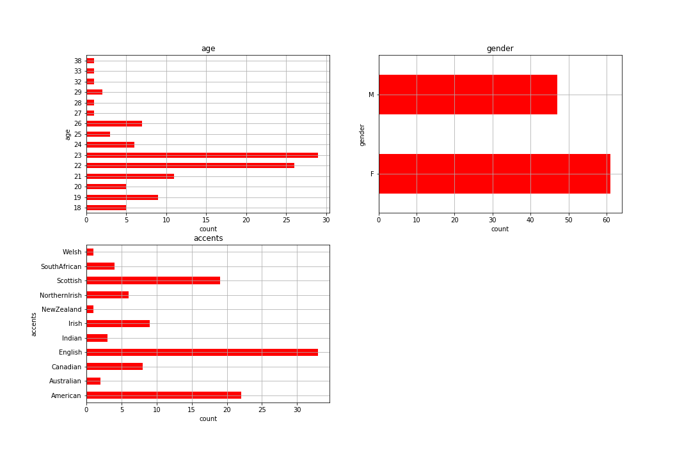

# The VCTK Dataset

* Samples of <transcript, audio> data
* Speaker metadata
 
 ## Examples: <transcript, speaker, audio>
<audio src="vctk/samples/p255_367.wav" controls></audio> 

| id_vctk | age | gender | accents | region | audio | transcript | 
| --- | --- | --- | --- | --- | --- | --- |
| 253 | 22 | F | Welsh | Cardiff | <audio src="vctk/samples/p255_367.wav" controls></audio>  | "She went with him to the store" |

| speaker | transcript | audio | 
| --- | --- | --- | 
| 253 (22/F/Welsh/Cardiff) | Anything is possible in football and we can beat Celtic again. | <audio src="vctk/samples/p255_367.wav" controls></audio>  |
| 314 (26/F/SouthAfrican/Cape Town) | Ahat was a bonus, but it was not the main objective. | <audio src="vctk/samples/p314_272.wav" controls></audio>  |
| 317 (23/F/Canadian/Hamilton) | That is a lot of writing.
 | <audio src="vctk/samples/p317_166.wav" controls></audio>  |
| 238 (22/F/NorthernIrish/Belfast) | The arrangement will avoid any conflicts of interest.
 | <audio src="vctk/samples/p238_165.wav" controls></audio>  |
| 376 (22/M/Indian) | The modern approach will also be reflected in the terms of address. | <audio src="vctk/samples/p376_193.wav" controls></audio>  |
| 301 (23/F/American/North Carolina) | I am sure all schools would accept that.
 | <audio src="vctk/samples/p301_102.wav" controls></audio>  |

## Speakers

[VCTK Speaker List](vctk_speaker_metadata_csv.html)
<html>
<iframe style="border-style: none;" src="vctk_speaker_metadata_csv.html" height="400" width="600"></iframe>
</html>

## Transcripts
[VCTK Transcripts](vctk/vctk_transcripts_all)

[VCTK Transcripts](vctk_transcript_csv.html)

<a href="/" target="vctk/vctk_transcripts_all">The home page will open in another tab.</a>

<html>
<iframe style="border-style: none;" src="vctk_transcript_csv.html" height="700" width="800"></iframe>
</html>
