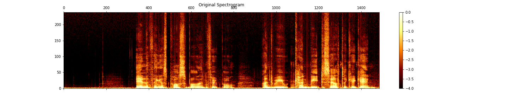

# The VCTK Dataset
* [CSTR VCTK Website](https://homepages.inf.ed.ac.uk/jyamagis/page3/page58/page58.html)
* Samples of <transcript, audio> data
* Speaker metadata
 
 ## Examples from the Datset
 * 40k examples across 108 speakers
 * Each example is of the form: <speaker, transcript, audio>

| id_vctk | age | gender | accents | region | audio | transcript | 
| --- | --- | --- | --- | --- | --- | --- |
| 253 | 22 | F | Welsh | Cardiff | Anything is possible in football and we can beat Celtic again. | <audio src="vctk/samples/p255_367.wav" controls></audio>  |
| 314 | 26 | F | SouthAfrican | Cape Town | That was a bonus, but it was not the main objective. | <audio src="vctk/samples/p314_272.wav" controls></audio>  |
| 317 | 23 | F | Canadian | Hamilton | That is a lot of writing. | <audio src="vctk/samples/p317_166.wav" controls></audio>  |
| 238 | 22 | F | NorthernIrish | Belfast | The arrangement will avoid any conflicts of interest. | <audio src="vctk/samples/p238_165.wav" controls></audio>  |
| 376 | 22 | M | Indian | | The modern approach will also be reflected in the terms of address. | <audio src="vctk/samples/p376_193.wav" controls></audio>  |
| 301 | 23 | F | American | North Carolina | I am sure all schools would accept that. | <audio src="vctk/samples/p301_102.wav" controls></audio>  |

| speaker | transcript | audio | 
| --- | --- | --- | 
| 253 (22/F/Welsh/Cardiff) | Anything is possible in football and we can beat Celtic again. | <audio src="vctk/samples/p255_367.wav" controls></audio>  |
| 314 (26/F/SouthAfrican/Cape Town) | That was a bonus, but it was not the main objective. | <audio src="vctk/samples/p314_272.wav" controls></audio>  |
| 317 (23/F/Canadian/Hamilton) | That is a lot of writing. | <audio src="vctk/samples/p317_166.wav" controls></audio>  |
| 238 (22/F/NorthernIrish/Belfast) | The arrangement will avoid any conflicts of interest. | <audio src="vctk/samples/p238_165.wav" controls></audio>  |
| 376 (22/M/Indian) | The modern approach will also be reflected in the terms of address. | <audio src="vctk/samples/p376_193.wav" controls></audio>  |
| 301 (23/F/American/North Carolina) | I am sure all schools would accept that. | <audio src="vctk/samples/p301_102.wav" controls></audio>  |

## Speakers
Speakers by attribute.

[VCTK Speaker List](vctk_speaker_metadata_csv.html)
<html>
<iframe style="border-style: none;" src="vctk_speaker_metadata_csv.html" height="400" width="600"></iframe>
</html>

## Transcripts
[VCTK Transcripts](vctk/vctk_transcripts_all)

<a href="/" target="index.md">Back to home page</a>

Example: [VCTK Transcripts for Speaker 225](vctk_transcript_csv.html)
<html>
<iframe style="border-style: none;" src="vctk_transcript_csv.html" height="700" width="800"></iframe>
</html>
