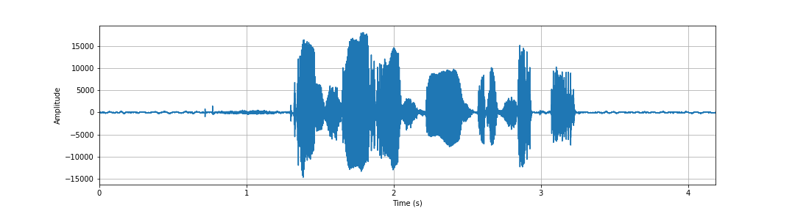
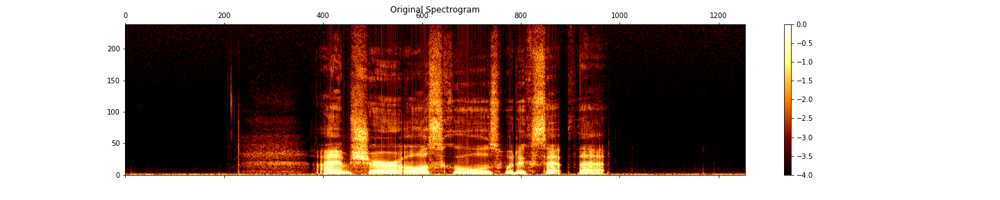
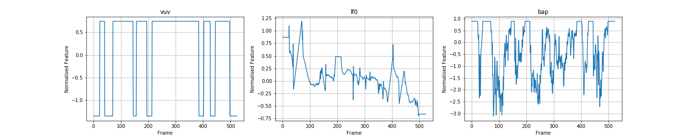

# Baseline VoiceLoop Models

* Sample synthesized speech from the two baseline models: VCTK-US-22 and VCTK-All-107
* Training curves?

## WORLD Features

## VoiceLoop Synthesized Speech
### Speaker 339: F/21/American/Pennsylvania
"There are exciting days ahead."
<audio src="vctk/synth_samples/orig_339_117.wav" controls></audio>
<audio src="vctk/synth_samples/synth_339_117.wav" controls></audio>

### Speaker 301: F/23/American/NorthCarolina
"There are exciting days ahead."
<audio src="vctk/synth_samples/orig_301_117.wav" controls></audio>
<audio src="vctk/synth_samples/synth_301_117.wav" controls></audio>

### Speaker 345: M/22/American/Florida
"There are exciting days ahead."
<audio src="vctk/synth_samples/orig_345_117.wav" controls></audio>
<audio src="vctk/synth_samples/synth_345_117.wav" controls></audio>