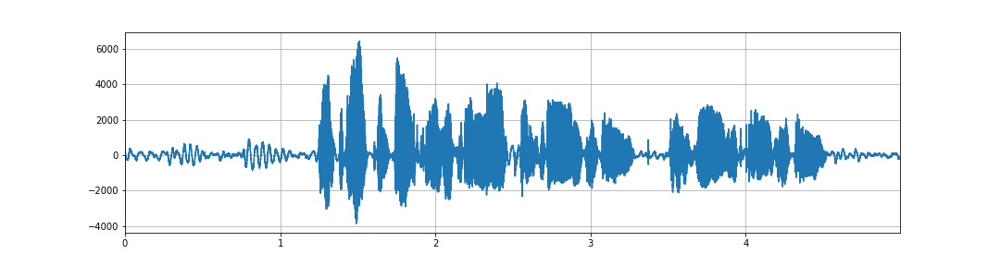
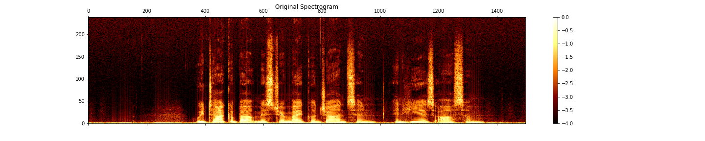
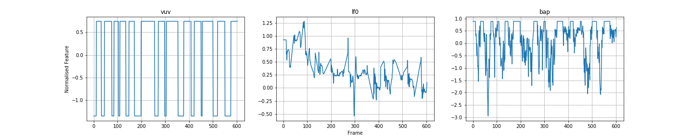
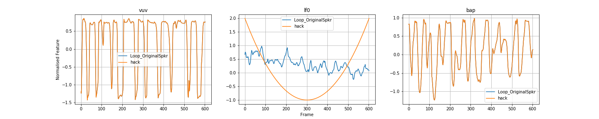
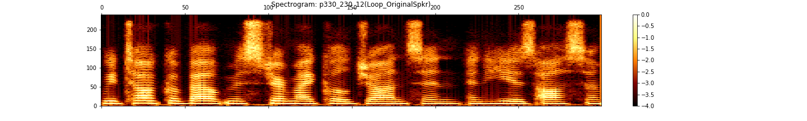
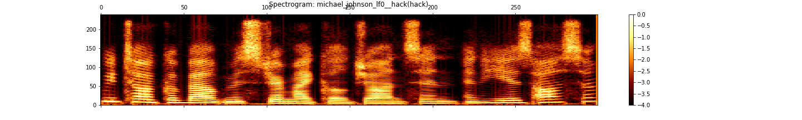
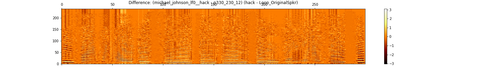

# WORLD Features

To illustrate WORLD acoustic features, I will use speaker 330 (an American female), sentence 230:  

> "We talk about Mr. Michael Johnson, and he is awesome."

* [Waveforms -> Acoustic Features](#from-waveforms-to-acoustic-features)
* [Interpreting lf0](#interpreting-lf0)

### From Waveforms to Acoustic Features
Start by listening to the **original VCTK sample (48kHz)**
<audio src="master/world_features_exploration/p330_230.wav" controls></audio>

The plot below shows the **waveform** (amplitude vs. time) of the utterance:

Here is the same utterance converted to a **spectrogram** (energy in each frequency band vs. time):

Now, we convert the utterance into sequences of **acoustic features** using the WORLD vocoder. All features have been normalised using the mean and standard deviation across the whole dataset. Plot shows only three of the 63 features.

Finally, we pass these features into the synthesis component of the WORLD vocoder to reconstruct the waveform. 
The following audio has be **reconstructed using WORLD (16kHz)**:
<audio src="master/world_features_exploration/p330_230_12.wav" controls></audio>

### Interpreting lf0

Here we illustrate the interpretability of one key feature, lf0 (log of F zero, the fundamental frequency or 'pitch'). I took the WORLD features for the utterance, and replaced the lf0 sequence with a quadratic profile that starts high, drops to a low value, and then rises back into the end of the sequence. 

I then passed this modified set of WORLD features (i.e. all 'correct' except for lf0) into the synthesis module of the WORLD vocoder to generate the following waveform. You can clearly perceive the falling-and-rising pitch introduced by modifying the lf0 feature.

<audio src="master/world_features_exploration/michael_johnson_lf0__hack.wav" controls></audio>

The spectrograms for the original and 'hacked' audio samples (and the difference) are shown below. It's possible to detect the pitch trajectory from the patterns of energy in the different frequency bands.

In general the other WORLD features are not so easy to interpret (although domain experts can do so.) Throughout my project I will refer back to the lf0 feature as the canonical example of a WORLD acoustic feature because of it's interpretability.
