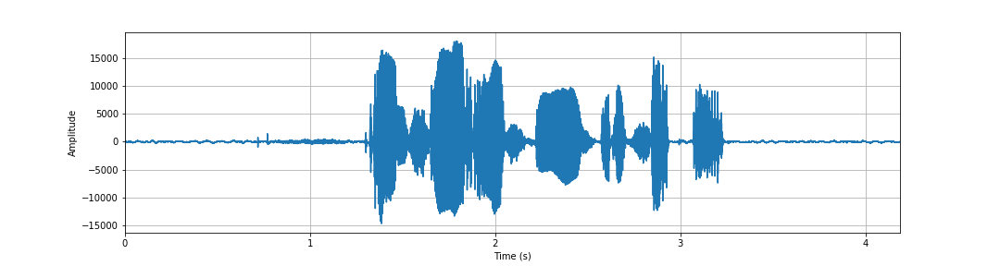
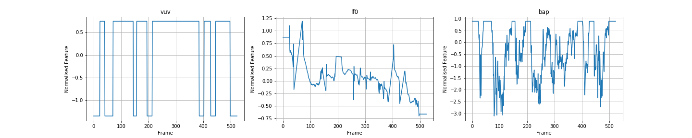

# WORLD Features
* State the sentence and speaker ID for this example

The plot below shows the waveform (amplitude vs. time) of a sample utterance:

The plot below shows the same utterance converted to a spectrogram (energy in each frequency band vs. time)

The plot below shows the utterance converted into sequences of acoustic features using the WORLD vocoder. All features have been normalised using the mean and standard deviation across the whole dataset.

## Impact of Modifying LF0
Here we illustrate the interpretability of one key feature, lf0 (log of F zero, the fundamental frequency or 'pitch'). I took the WORLD features for an utterance, and replaced the lf0 sequence with a quadratic profile that starts high, drops to a low value, and then rises back into the end of the sequence. 

I then passed this modified set of WORLD features (i.e. all 'correct' except for lf0) into the synthesis module of the WORLD vocoder to generate the following waveform. You can clearly perceive the falling-and-rising pitch introduced by modifying the lf0 feature.

<audio src="master/world_features_exploration/michael_johnson_lf0__hack.wav" controls></audio>

In general the other WORLD features are not so easy to interpret (although domain experts can do so.) Throughout my project I will refer back to the lf0 feature as the canonical example of a WORLD acoustic feature because of it's interpretability.